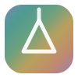

<div align="center">
  

  # Prisma

  **Entenda possíveis sinais de autismo, sem pressa nem julgamento.**

  Uma plataforma **IDASAM**, desenvolvida em parceria com a **MAZARI CORP.**
</div>

---

> ⚠️ **Prisma é uma ferramenta de _orientação_, não de diagnóstico.**
> Nenhum questionário confirma ou descarta autismo. O Prisma estima uma **faixa de sinais** e sempre encaminha para uma **avaliação profissional**. Só uma equipe qualificada pode diagnosticar o Transtorno do Espectro Autista (TEA).

## O que é

Prisma é um rastreio (_screening_) acolhedor e acessível de sinais associados ao autismo. Ele roteia a pessoa para o instrumento validado certo, faz as perguntas **uma tela de cada vez, sem pressa e sem timer**, e entrega um **mapa por área** + **próximos passos** — nunca um rótulo.

O diferencial não é "mais um quiz": é uma experiência **desenhada para ser confortável a pessoas autistas** (previsível, baixo estímulo, linguagem literal, progresso sempre visível), com ajustes sensoriais embutidos.

## O que NÃO é

- ❌ Não é diagnóstico nem laudo.
- ❌ Não diz "você é autista" / "seu filho é autista".
- ❌ Não substitui consulta com profissional.
- ✅ É orientação + psicoeducação + encaminhamento responsável.

Veja as regras inegociáveis em [`docs/CANON.md`](docs/CANON.md).

## Como funciona

1. **Perfil** — a pessoa escolhe quem vai responder (adulto em autoavaliação · responsável avaliando uma criança).
2. **Instrumento certo** — o app aplica o questionário validado adequado àquele perfil.
3. **Questionário calmo** — uma pergunta por tela, Voltar sempre disponível, sem tempo, sem pressão.
4. **Resultado como mapa** — faixa de sinais + distribuição por área + próximos passos concretos (incluindo caminhos no SUS).
5. **Papel timbrado** — botão "Baixar resultado (PDF)" gera um relatório em papel timbrado (via impressão → salvar como PDF) com o rodapé de parceria IDASAM + MAZARI CORP.
6. **Local-first** — as respostas ficam **apenas no aparelho**. Nada é enviado.

> **Aprofundamento (adulto):** depois do AQ-10, dá para fazer o **CAT-Q** (camuflagem). O app cruza os dois resultados e gera um PDF combinado — o padrão *poucos sinais aparentes + camuflagem alta* costuma indicar diagnóstico tardio (comum em mulheres e adultos).

## Instrumentos e pontuação

| Perfil | Instrumento | Itens | Faixas |
|---|---|---|---|
| Adulto (autoavaliação) | **AQ-10** (Allison, Auyeung & Baron-Cohen, 2012) | 10 | 0–3 poucos · 4–5 alguns · **≥6 vários** (indicação de avaliação) |
| Adulto — aprofundamento | **CAT-Q** (Hull et al., 2018) | 25 | Camuflagem em 3 subescalas (Compensação/Máscara/Assimilação); **≥100** de 25–175 = camufla |
| Criança 16–30 meses (responsável) | **M-CHAT-R/F** (Robins, Fein & Barton) | 20 | 0–2 baixo · 3–7 moderado (seguimento) · 8–20 alto |
| Criança 4–11 anos (responsável) | **CAST** (Scott, Baron-Cohen et al., 2002) | 30 | corte de encaminhamento **≥15** · gratuito (Cambridge/ARC) |

> **Nota de fidelidade:** os itens do adulto seguem o AQ-10. Os itens da criança estão **adaptados para o protótipo** — antes de qualquer uso em produção, devem ser substituídos pela **redação oficial validada em português** do M-CHAT-R/F (Sociedade Brasileira de Pediatria). A lógica de pontuação já é a oficial.

## Acessibilidade (autista-friendly)

- Uma pergunta por tela · progresso sempre visível · sem timer.
- Botão **⚙︎ Ajustes**: *Reduzir movimento* e *Texto maior* (persistidos localmente).
- Respeita `prefers-reduced-motion` e `prefers-color-scheme` (tema claro/escuro).
- Alvos de toque grandes, foco de teclado visível, linguagem literal.

## Rodar localmente

Site 100% estático, sem build. Qualquer servidor estático serve:

```bash
# Python (já vem no Windows via 'py')
python -m http.server 8899
# → abra http://127.0.0.1:8899

# ou Netlify CLI
netlify dev
```

> Abrir o `index.html` direto pelo `file://` funciona para o fluxo, mas o `manifest.json` e futuros recursos PWA exigem `http://`. Prefira o servidor local.

## Deploy (Netlify)

O [`netlify.toml`](netlify.toml) já está pronto: sem comando de build, `publish = "."`, headers de segurança (CSP) e cache. Basta conectar o repositório `Opresida/prisma` no Netlify (ou `netlify deploy --prod`).

**Domínio:** as tags `og:url` / `og:image` / `canonical` em `index.html` apontam para `https://prismatea.netlify.app` (subdomínio Netlify). Se migrar para domínio próprio, atualize-as e regenere nada mais.

## Estrutura

```
prisma/
├── index.html          # Casca: <head> (SEO/OG), boot spinner, top bar, #stage
├── styles.css          # Design system, spinner, papel timbrado (print), telemedicina
├── app.js              # Instrumentos, scoring, telas, papel timbrado, ajustes
├── manifest.json       # PWA
├── netlify.toml        # Deploy + headers/CSP
├── assets/
│   ├── favicon.svg     # Marca (espectro/prisma)
│   ├── og-image.png    # Card social 1200×630
│   └── og-ciencia.png  # Card social exclusivo da /ciencia
├── og.html             # Fonte do OG (renderizada → og-image.png)
├── ciencia.html        # Rota /ciencia — fundamentação científica (documento p/ IDASAM)
├── og-ciencia.html     # Fonte do OG exclusivo da /ciencia
└── docs/
    ├── CANON.md          # ⚖️ Regras inegociáveis (clínicas/éticas)
    ├── CONTEXT.md        # Produto, público, posicionamento, regulatório
    ├── ARCHITECTURE.md   # Arquitetura técnica
    ├── TODO.md           # Roadmap / backlog
    └── PROJECT_CONTEXT.md# Snapshot: estado atual e como retomar
```

## Privacidade & LGPD

Dado de saúde é **dado sensível** (LGPD, fiscalizado pela ANPD). Por isso o Prisma é **local-first**: as respostas são processadas no navegador e **não saem do aparelho**. Nenhum recurso que envie respostas para um servidor deve ser adicionado sem **consentimento explícito** e base legal. Detalhes em [`docs/CANON.md`](docs/CANON.md) e [`docs/CONTEXT.md`](docs/CONTEXT.md).

## Roadmap

- 🩺 **Telemedicina (em breve)** — atendimento imediato com profissionais capacitados e direcionados.
- 🎭 **Camuflagem (CAT-Q)** — feito: aprofundamento opcional do adulto após o AQ-10, com PDF combinado e cruzamento "poucos sinais + camuflagem alta = perfil de diagnóstico tardio".
- 🧩 **Faixa 4–11 anos (CAST)** — feito: cobertura da idade escolar. Optou-se pelo CAST (gratuito, Cambridge) em vez do SCQ (licenciado/pago, WPS).
- 🔬 RAADS-R — aprofundamento completo do adulto (pendente).
- 📄 Itens oficiais validados PT-BR do M-CHAT-R/F.
- 📈 Histórico local para acompanhar evolução ao longo do tempo.

Backlog completo em [`docs/TODO.md`](docs/TODO.md).

## Créditos

**Prisma** — uma plataforma **IDASAM**, desenvolvida em parceria com a **MAZARI CORP.**

Instrumentos de rastreio de seus respectivos autores (AQ-10; M-CHAT-R/F), usados aqui para fins de orientação e educação. Este projeto não é afiliado aos autores dos instrumentos.
